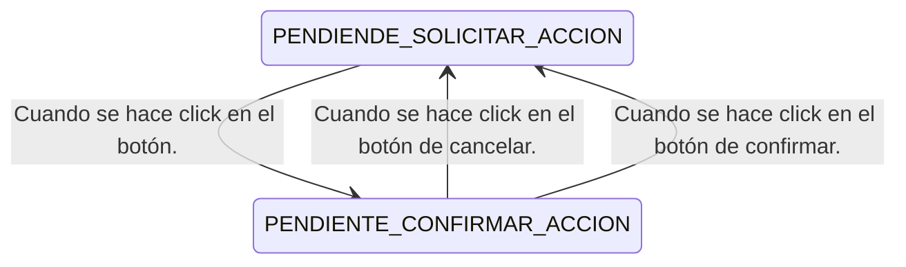

# Componente AccionConfirmableComponent

## Diagrama de Estados

```mermaid
stateDiagram-v2
    PENDIENDE_SOLICITAR_ACCION
        PENDIENDE_SOLICITAR_ACCION --> PENDIENTE_CONFIRMAR_ACCION: Cuando se hace click en el botón.
    PENDIENTE_CONFIRMAR_ACCION
        PENDIENTE_CONFIRMAR_ACCION --> PENDIENDE_SOLICITAR_ACCION: Cuando se hace click en el botón de cancelar.
        PENDIENTE_CONFIRMAR_ACCION --> PENDIENDE_SOLICITAR_ACCION: Cuando se hace click en el botón de confirmar.
```
