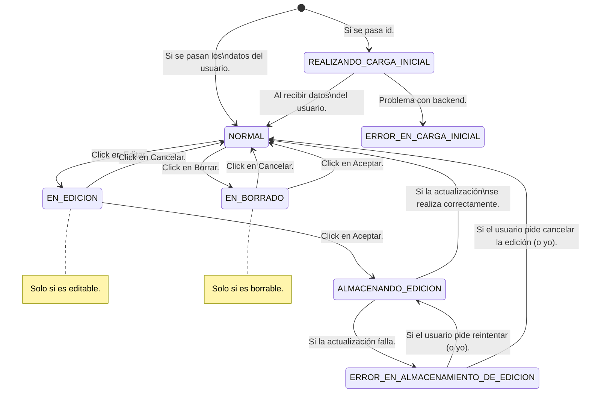

# UsuarioComponent

El User component está regido por una máquina de estados.
Y tiene su propio modelo de datos.

## API de comunicacion

### Inputs

| Nombre | Tipo | Descripción |
| ------ | ---- | ----------- |
| usuario | DatosDeUsuario \| number | Datos del usuario o id del usuario a cargar. |
| modoExtendido | boolean | Si se muestra el modo extendido. |
| borrable | boolean | Si se muestra el botón de borrar. |
| editable | boolean | Si se muestra el botón de editar. |

### Outputs

| Nombre | Tipo | Descripción |
| ------ | ---- | ----------- |
| usuarioBorrado | BorradoConfirmado | Se emite cuando se confirma el borrado. |
| usuarioEditado | EdicionConfirmada | Se emite cuando se confirma la edición. |
| usuarioCargado | CargaFinalizada | Se emite cuando se cargan los datos del usuario. |
| usuarioError | CargaFallida | Se emite cuando falla la carga de datos del usuario. |
| cargaIniciada | CargaIniciada | Se emite cuando se inicia la carga de datos del usuario. |
| edicionIniciada | EdicionSolicitada | Se emite cuando se inicia la edición de datos del usuario. |
| borradoIniciado | BorradoSolicitado | Se emite cuando se inicia el borrado de datos del usuario. |
| borradoCancelado | BorradoCancelado | Se emite cuando se cancela el borrado de datos del usuario. |
| edicionCancelada | EdicionCancelada | Se emite cuando se cancela la edición de datos del usuario. |


## Estados del componente: EstadosComponenteUsuario

```typescript
export enum EstadosComponenteUsuario {
    NORMAL = 0,
    EN_EDICION = 1,
    EN_BORRADO = 2,
    CARGANDO = 3,
    ERROR = 4,
    INICIO = -1
}
```


## Modelo de datos: UsuarioComponentModel

```typescript
export interface UsuarioComponentModel {
    estado: EstadosComponenteUsuario;
    borrable: boolean;  
    editable: boolean;
    datosDeUsuario?: DatosDeUsuario;
    error?: Error;
    id: number;
}
```

## Diagrama de estados: UserComponent




