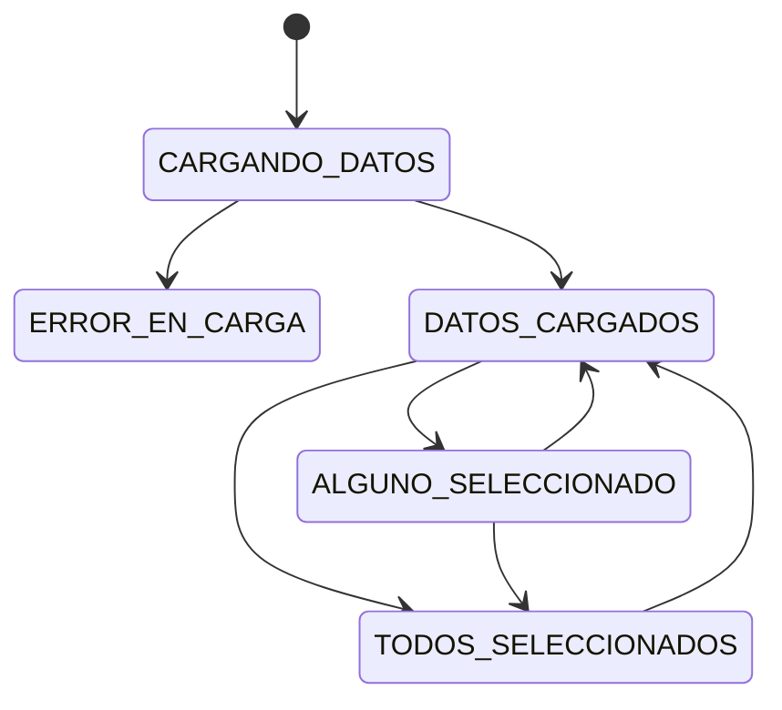

LISTADO DE USUARIOS
@Input usuariosEditables
@Input usuariosBorrables
datosUsuarios?: Array<DatosDeUsuario>
datosSeleccionados?: Array<DatosDeUsuario>
usuariosAMostrar?: Array<DatosDeUsuario>

formulario para el filtro (Reactivos, Tradicionales,... Identificador)
    filtroActual: string
state: number

> Peticion al servicio: getUsuarios()

    FILTRO [          ] BUSCAR (o auto)
        por todos los campos del usuario (nombre, apellidos, email)
    
    Si usuariosBorrables entonces:
    [SeleccionarTodos] [DeseleccionarTodos] [Borrar (los seleccionados)] 

    > Datos usuario 1
    > Datos usuario 2
    > Datos usuario 3

Las comunicaciones entre el listado y los usuarios las realizamos a través de eventos.
    En un rato, cuando esté funcionando, las meteremos con REDUX.

## ESTADOS DEL COMPONENTE

