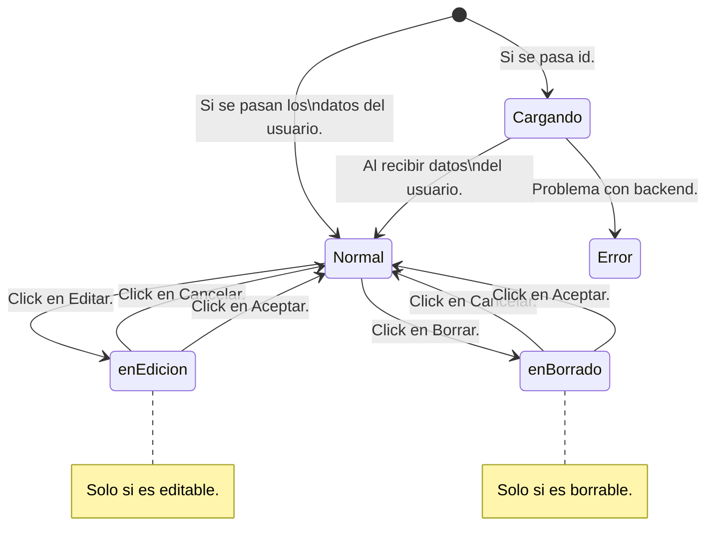

# Componente que renderice la información de un usuario por pantalla

Usuario: Nombre, Apellidos, Edad, email

```js
    Modelo para representar la información del Usuario
            nombre, apellidos, edad, email
        Componente Usuario
            - Tiene como propiedad el modelo que renderizar 
        Cómo obtenemos la instancia concreta del Usuario que debemos renderizar:
            - Que el componente lo solicite:
                - Al backend: PROHIBIDO !!! Se puede hacer SI... lo haremos NUNCA JAMAS
                    Si hicieramos esto, nos estaríamos cagando en el principio "S"olid
                        S: Responsabilidad única.
                    Estoy acoplando el componente al backend
                - A un componente que se lo suministre: SERVICIO
                    dameDatosDeUsuario(id) -> Usuario
            - Que se le inyecte


        import {ServicioDeUsuarios} from com.miapp.services.usuarios.ServicioDeUsuarios;
        //import {ServicioDeUsuariosImpl} from ...com.miapp.services.usuarios.ServicioDeUsuariosImpl; // RUINA GRANDE !!!!
            // Ya he acoplado (generado una dependencia) entre el componente y una Implementación concreta del Servicio de Usuarios
            // Romper el principio de la Inversión de dependencia:
            // Un componente de alto nivel no debería depender de implementaciones concretas de un módulo de más bajo nivel
        @Component(                     /// Lenguaje DECLARATIVO
            selector: 'usuario',
            //template...
            //css...
        )
        // Angular!!! Cuando alguien quiera unar una marca <usuario>, el código que la gobierna es éste.
        // Aquí te explico: Su lógica
        // Su representación
        // Sus estilos...
        // Ocupate tú!!!!

        class UsuarioComponent implements OnInit{
            #usuario?:Usuario
            #servicio:ServicioDeUsuarios

            constructor(servicio:ServicioDeUsuarios){ // Inyección de dependencias:
            // Patrón por el cuál una clase no crea instancias de los objetos que necesita sino que le son suministradas
            // Al suministrarle la instancia concreta, ya no depende de la implementación
                // Aquí pedimos al servicio? NO
                this.servicio=servicio
            }

            onInit(){ // Cuando se va a pinchar en el DOM 
                // Hacer la llamada al Servicio
                // let servicio:ServicioDeUsuarios = new ServicioDeUsuariosImpl(); 
                var observable = servicio.getUsuario(17) // Asíncrona
                observable.subscribe(....)
            }
        }
        // Quien debe suministrar el servicio? El que cree el UsuarioComponent
        // En algún sitio hay que hacer un              new ServicioDeUsuariosImpl()
        // Ese código también lo escribe Angular...
        // Y eso se lo tenemos que decir a Angular: OYE, cuando te soliciten un : ServicioDeUsuarios -> ServicioDeUsuariosImpl
        // Pero Angular no sabe, de que clase debe instanciar, cuando en un constructor se solicite un ServicioDeUsuarios
        // Cuando hace angular, esta linea de abajo? Cada vez que en el navegador se use la marca HTML 
        //          <usuario id="17"/>
        //          <usuario id="23"/>
        // Por algún sitio va a existir un : var usuarioComponent1 = new UsuarioComponent( servicio );
        //                                   lo pinchará en el DOM
        //                                   usuarioComponent1.onInit();
        // Angular es quien ejecuta eso
        ...

        interface ServicioDeUsuarios {
            getUsuario(id:Number):Observable<>;
        }

        ...

        class ServicioDeUsuariosImpl implements ServicioDeUsuarios {
            getUsuario(id:Number):Observable<>{
                // CODIGO
            }
        }

        @NgModule({
            declarations: [
                Todos los componentes de mi app
                // Si cambiais el orden de los compoentes en esta lista afecta a algo? NO
            ],
            imports: [], // Otros modulos que queremos que se puedan utilizar desde éste
            providers: [ // Cuando queremos que se encargue de la inyección de dependencias, cómo debe resolverlas
                ServicioDeUsuarios -> ServicioDeUsuariosImpl // Puedo tener 17 implementaciones... De hecho eso es muy habitual cuando TEST
            ]
        })
        class AppMopdule{}

```

Los datos del usuario los saco de un servicio REST en backend.

---
components:
    UsuarioListComponent    <usuario-list>
        Va a hacer uso: <usuario>
    UsuarioComponent        <usuario>  -> Va a admitir 2 modos de trabajo:
                                            Le pueden pasar el ID de un usuario
                                            Le pueden pasar el Usuario en si mismo
    html:
        <h2> {Usuario.nombre}
services:
    UsuarioService           Interfaz
        getUsuario(id:Number): Observable<Usuario>
        getUsuarios(FILTROS...): Observable<Array<Usuario>>
       > UsuarioServiceImpl          -> Bend REST
                                        GET http://mibackend/api/v2/usuario/17
                                json    <<< 
                                {nombre:, apellidos:, edad:, email: } -> Mapper -> Usuario
                                Según la estructura definida en el API del servicio REST en backend
       > UsuarioServiceFake       TestDoubles (stub, fake, spy, mock, dummy)
models:
    Usuario
mappers:
    usuarioMapper   Su misión es AISLARNOS / DESACOPLARNOS de Backend
        Esa API Backend: http://mibackend/api/v2/usuario/{id} {nombre:, apellidos:, edad:, email: }
            en un momento dado puede evolucionar:  v2.0.0 -> v2.1.0
            http://mibackend/api/v2/usuario/{id} {nombre:, apellidos:, edad:, email:, telefono: }
            en un momento dado puede evolucionar:  v2.1.0 -> v3.0.0
            http://mibackend/api/v2/usuario/{id} {firstName:, lastName:, age:, email:, phone: }

module:
    app

Los mappers se inyectan, igual que los servicios.
    {firstName:, lastName:, age:, email:, phone: } --> Usuario: (nombre:, apellidos:, edad:, email:, telefono: )

Route

---

UsuarioComponent:
    2 formas de suministrarle (desde el padre) el usuario que debe representar (id, Usuario)
    Va a tener 2 modos de representación: 
    - COMPACTO
        :) Nombre Apellidos [v] + -> Nos saca el resto de info (overlay)
    - EXTENDIDO
        +-------+-------------------------------+
        |       |   Nombre:                     |
        | O  O  |   Apellidos:                  |
        | ____  |   Edad:                       |
        |       |   Email:                      |
        +-------+-------------------------------+

UsuarioListComponent

---
App de gestión de vacaciones:
    Por ejemplo, para sacar mis datos (yo, el hacedor del login)
        Arriba en la barra de navegación: :) Nombre Apellidos
    Por ejemplo en la pantalla de aprobar solicitud de un empleado
        Fecha de solicitud
        Motivos...
        Solicitante: :) Nombre Apellidos [v]                Aprobador: :) Nombre Apellidos [v]   [EDITAR]
                    <usuario id="27">           -> Servicio <<< DatosUsuario
---
App de gestión de expedientes de LO QUE SEA
    Por ejemplo, para sacar mis datos (yo, el hacedor del login)
        Arriba en la barra de navegación: :) Nombre Apellidos
    Tengo la pantalla con de el detalle de un EXPEDIENTE:
        Iniciador: :) Federico [v]
        Aprobadores:
            :) Lucas        [v] [BORRAR]                                         <usuario datosUsuario=" OBJETO1 ">
            :) Francisco    [v] [BORRAR]                                         <usuario datosUsuario=" OBJETO2 ">
            :) Menchu       [v] [BORRAR] -> [Cancelar] [Aceptar] -> REDUX        <usuario datosUsuario=" OBJETO3 ">
                                            DELETE https://myempresa.com/api/v1/expediente/17/aprobadores/36
        Revisores:      GET https://myempresa.com/api/v1/expediente/17/revisores
            :) Lucas        [v] [BORRAR]
            :) Francisco    [v] [BORRAR]    DELETE https://myempresa.com/api/v1/expediente/17/revisores/36
            :) Menchu       [v] [BORRAR] -> [Cancelar] [Aceptar]

        ServicioExpedientes: NO TENDRA LAS TIPICAS OPERACIONES CRUD ( o si, pero tendrá más)
            recuperarExpediente 
            nuevoRevisor
            nuevoAprobador
            eliminarRevisor
            eliminarAprobador

        Componente de la pantalla de revisores de un expediente

---
App de gestión de usuarios:
    Listado de los usuarios: [Seleccionar Todos] [Deseleccionar todos] [Borrar todos]
            :) |Lucas   | |Ramirez    |     [v] [EDITAR] -> [Cancelar] [Aceptar]
            :) Francisco    [v]                 [EDITAR] [BORRAR] DELETE https://myempresa.com/api/v1/usuarios/17
            :) Menchu       [v]                 [EDITAR]
            :) Paquita      [v]                 [EDITAR]
            ** Al pinchar en editar en 1 de ellos:
                - Se cambian sus datos por un formulario
                - Se cambia el botón de EDITAR por ACEPTAR y cANCELAR
                - El resto de botones EDITAR deben desaparecer (o desactivarse)
<listado-usuario>
    <usuario datosUsuario=" OBJETO1 " borrable={true} (onBorradoIniciado)={ marcará que hay un usuario borrandose }>
    <usuario datosUsuario=" OBJETO2 " borrable={false}>
    <usuario datosUsuario=" OBJETO3 " borrable={false}>
</listado-usuario>


----

Modelo Usuario:
nombre
apellidos
id
foto
edad
email *
telefono *

Cuando llame al Backend: GET https://myempresa.com/api/v1/usuarios/{id}
    Qué recibo? Todos los datos: DatosDeUsuario {nombre, apellidos, id, foto, edad, email, telefono}
Cuando llame al Backend: PUT https://myempresa.com/api/v1/usuarios/{id}
    Qué mando? DatosModificablesDeUsuario {email, telefono}

// Principios SOLID

Facilmente mantenibles => Si el día de mañana viene un compalñero nuevo al proyecto..
Y tiene que montar algo (un cambio, nueva funcionalidad) en la modificación del envío de los datos modificables de un usuario.
---

# Componente usuario (altamente reutilizable) / Lógica del componente asociada a su ciclo de vida componente.clase.ts
                                              / Lógica de representación gráfica                  componente.render.html
## Props

usuario: DatosDeUsuario | number                                        @Input
ModoExtendido (boolean)                                                 @Input
Borrable (boolean) \                                                    @Input
Editable (boolean) / Características de mi componente                   @Input

EnBorrado (boolean)                     \
EnEdicion (boolean)                     / Estado del componente / Tiene su lógica
Estado: EnBorrado, EnEdicion, Normal   /

      +-Cancelar------------+
      |                     |
      +--Aceptar------------+
      v                     |
    Normal -?borrable-> EnBorrado
      ^    -?editable-> EnEdicion
      |                     |
      +-Cancelar------------+
      |                     |
      +--Aceptar-?dirty-----+ (Si ha habido cambio en los datos)

Cada camino (cambio de estado) es un evento que puedo soltar (OUTPUT)

Servicio (que hay que inyectarlo)

## Outputs (Eventos) / Con las acciones que se puedan realizar sobre mi componente... y que a otros le puedan interesar

(Una forma sencilla de empezar a identificar acciones es mirar los botones o enlaces de acción que tiene el componente) - Cambios en mi estado
onEdicionIniciada
onEdicionCancelada
onEdicionConfirmada *
onBorradoIniciado
onBorradoCancelado
onBorradoConfirmado *

deshabilitarBotonesEdicion
deshabilitarBotonesBorrado

## Renderización

    <div>
        <h3> Datos del polluelo</h3>
        <div id ="botonera">
            <boton-confirmable *ngIf="CONDICION_PARA_SACAR_EL_BOTON_DE_EDITABLE" >Editar</boton-confirmable>
            <boton-confirmable *ngIf="CONDICION_PARA_SACAR_EL_BOTON_DE_BORRABLE" >Borrar</boton-confirmable>
        </div>
    </div>

    CONDICION_PARA_SACAR_EL_BOTON_DE_EDITABLE?
        Si es Editable...Siempre? Seguro? No hay nada más dentro de mi componente que me indique si debo o no sacar el botón
            Siempre y cuando no haya pulsado ya en borrar

## Lógica del componente (asociada a su ciclo de vida)

Creación: 
    usuario (id | datos)
OnInit:
    Si me han pasado un id, tengo que ir a buscar los datos del usuario al servicio
    Eso va a ser asíncrono
        Cuando me lleguen los datos del usuario, los pinto
    Y mientras tanto? Mostrar algo por pantalla (Mensaje: cargando..., icono: spinner)

    propiedad cargando....

# Componente BotonConfirmable

---

# Microfrontales?

Dividir la app en partes más pequeñas... de forma que incluso esas partes se puedan desarrollar con tecnologías diferentes
(parte1 -> Angular, parte2 -> React)

WebComponent -> W3C

